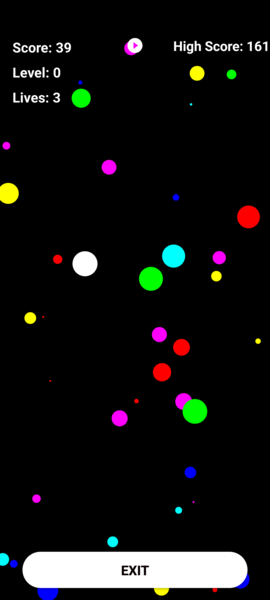
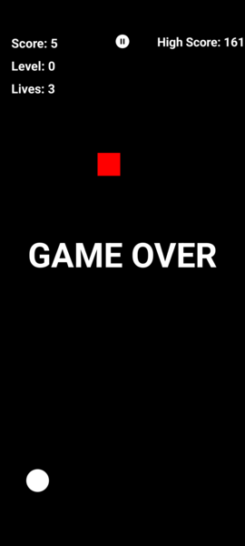

# Bolas - Juego para Android
----------------------------

Bolas es un juego de habilidad y estrategia para Android, en el que los jugadores controlan una bola para navegar por el escenario, superar obstáculos y evitar enemigos con el objetivo de lograr la puntuación más alta.

## Bolas - Video
----------------

 "Bolas Video")

## Bolas - Imagenes
-------------------

## Bolas - Descripcion
----------------------

"Bolas" es un emocionante y adictivo juego para Android que pone a prueba tus reflejos y habilidades para esquivar obstáculos. Con una mecánica de juego sencilla e intuitiva, "Bolas" te proporciona horas de entretenimiento en la palma de tu mano.

## Bolas - Características
--------------------------

- Mecánica de juego sencilla e intuitiva: toca y arrastra para mover las bolas en la pantalla y evitar obstáculos.
- Tres estados de juego dinámicos: Esperando, Jugando y Game Over.
- Pausa y reanuda el juego en cualquier momento.
- Guarda y compite con tu puntuación más alta usando SharedPreferences.
- Efectos de sonido emocionantes y música de fondo con MediaPlayer.
- Diseño de pantalla completa y optimizado para dispositivos modernos y versiones anteriores de Android.
- Reinicio rápido del juego con controladores táctiles personalizados.
- Desafíos progresivos que aumentan la dificultad a medida que avanzas.

## Requisitos
-------------

- Android 5.0 (API level 21) o superior

## Instalación
--------------

1. Clona este repositorio en tu computadora local o descarga el código como archivo ZIP.
2. Abre el proyecto en Android Studio.
3. Ejecuta el proyecto en un emulador de Android o en un dispositivo físico conectado.

## Uso
------

1. Al iniciar el juego, las bolas aparecerán en la pantalla y el estado del juego estará en "Esperando".
2. Toca la pantalla para comenzar a jugar.
3. Arrastra las bolas para esquivar los obstáculos y recolectar potenciadores.
4. Si chocas con un obstáculo, el juego terminará y mostrará tu puntuación.
5. Toca la pantalla para reiniciar el juego y seguir jugando.

## Contribuciones
-----------------

Las contribuciones son bienvenidas. Siéntete libre de abrir un issue o crear un pull request si encuentras un bug o quieres sugerir mejoras.

## Licencia
-----------

Este proyecto está licenciado bajo la Licencia MIT. Consulta el archivo [LICENSE](LICENSE) para obtener más información.
