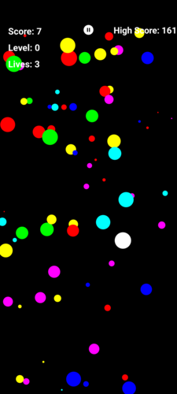

# Bolas

Bolas es un juego de habilidad y estrategia para Android, en el que los jugadores controlan una bola para navegar por el escenario, superar obstáculos y evitar enemigos con el objetivo de lograr la puntuación más alta.

## Características

- Gráficos coloridos y atractivos
- Mecánicas de juego interactivas
- Música de fondo y efectos de sonido

## Cómo compilar y ejecutar

1. Clone este repositorio: `git clone https://github.com/yourusername/Bolas.git`
2. Abra el proyecto en Android Studio
3. Ejecute el proyecto en un emulador o dispositivo Android conectado

## Contribuir

Las contribuciones son bienvenidas. Siéntase libre de abrir una issue o enviar un pull request si encuentra algún error o desea agregar una nueva característica.

## Licencia

Bolas está licenciado bajo [MIT License](LICENSE).
